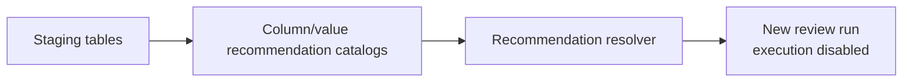
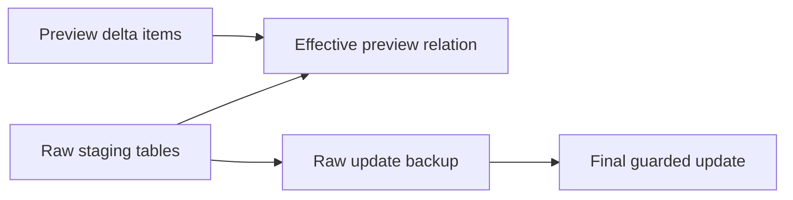

# Public Database Notes

This project expects tabular source data to be loaded into relational staging tables before the workflow evaluates natural-language change requests.

## Public Contract

- Staging tables should reflect the current local schema before a workflow run.
- Raw source values should be preserved until validation or transformation rules explicitly handle them.
- Provenance columns may be used locally, but public documentation should describe them generically.
- Identifier-like fields and display-name fields should remain separate unless a validated mapping explicitly proves they are equivalent.

## Validation Principles

Generated SQL should be checked against live database metadata before sample-impact review or execution.

Validation should include:

- target table allowlists
- target column allowlists
- parameter count checks
- blocked SQL token checks
- fingerprinting of approved statements
- sample-impact generation before write execution
- backup coverage before final raw updates
- linked-step delta isolation by plan, step, target table, and source row

Optional recommendation catalogs may be maintained outside the raw staging tables. These catalogs should contain only the metadata needed to suggest likely columns or values at request time. Public documentation should describe them generically and should not include real source values.

Linked-step preview deltas and raw-update backups should live outside the raw staging tables. Preview deltas represent hypothetical approved preview state for dependent calculations. Backup rows represent the pre-update raw state needed before a final approved raw mutation.





## What Not To Publish

Do not publish real table samples, row counts, source filenames, source-channel values, production database names, credentials, or business-specific column mappings.

Use placeholders when documentation needs an example:

```sql
SELECT COUNT(*) AS rows FROM <staging_table>;
```
