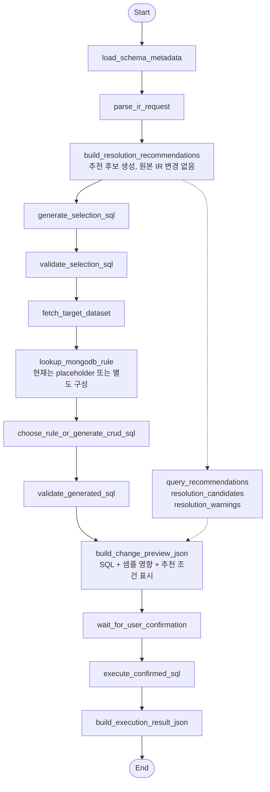
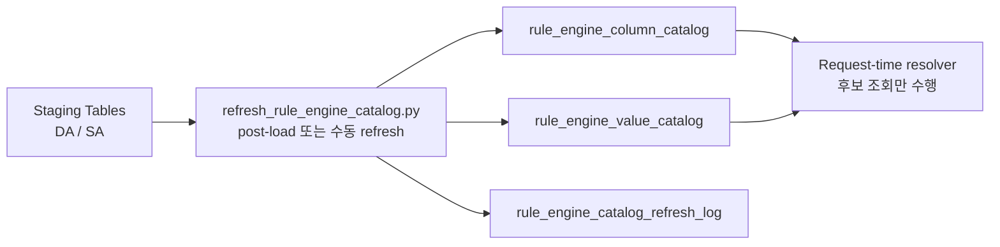
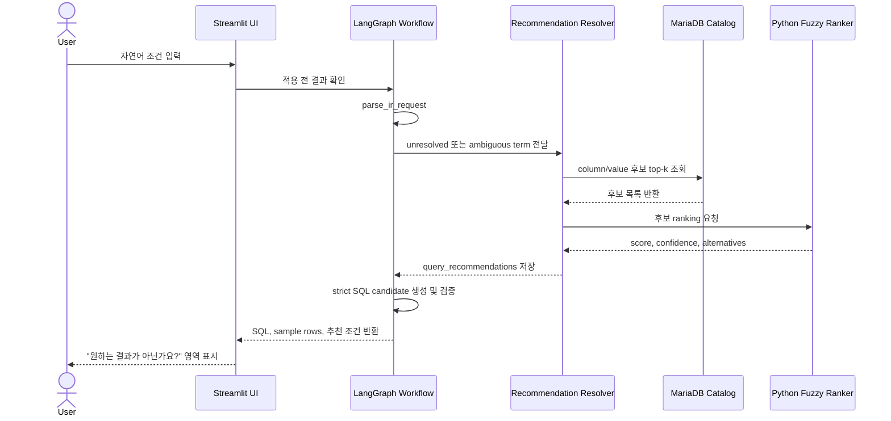
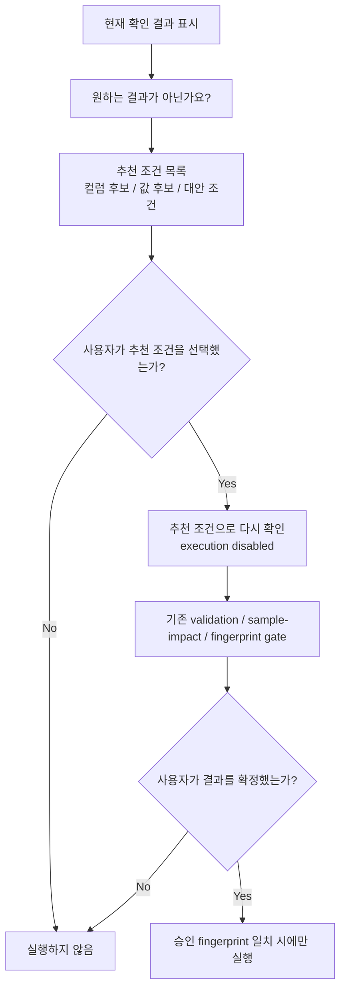
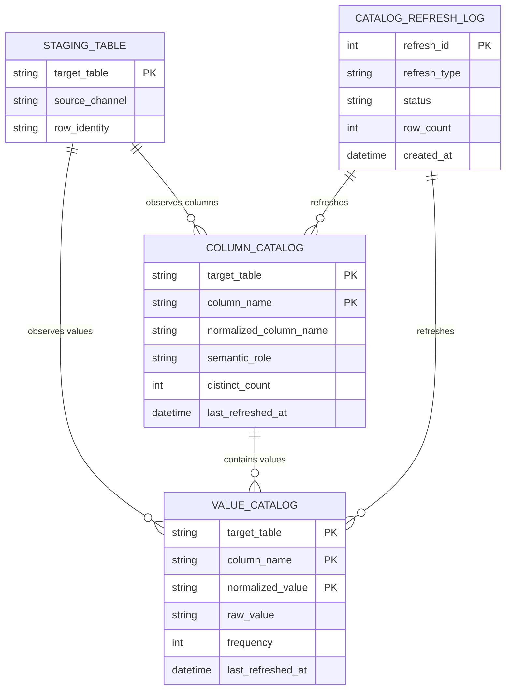

# 유사 검색 추천 아키텍처

이 문서는 자연어 SQL workflow에 유사 검색 기반 추천 기능을 추가하는 공개용 설계 문서다. 핵심 목표는 없는 컬럼명이나 값이 입력되었을 때 시스템이 조건을 몰래 치환하지 않고, 적용 전 확인 화면에서 사용자가 선택할 수 있는 추천 조건을 제시하는 것이다.

공개 문서이므로 실제 고객명, 원천 파일명, source value, row sample, 운영 DB명, 로컬 경로, credential, 내부 prompt 전문은 포함하지 않는다.

## 1. 설계 원칙

- 유사 검색 결과는 원본 질의를 자동 변경하지 않는다.
- 추천 조건은 사용자가 명시적으로 선택해야 한다.
- 추천 조건도 항상 다시 적용 전 확인부터 실행한다.
- 추천 조건으로 생성된 SQL도 기존 validation, sample-impact, confirmation, fingerprint gate를 그대로 통과해야 한다.
- UPDATE 요청은 잘못된 fuzzy match가 row를 잘못 수정할 수 있으므로 SELECT보다 더 보수적으로 다룬다.

## 2. 전체 Workflow 삽입 위치

기존 workflow는 natural-language request를 IR, SQL candidate, validation, sample-impact review, confirmation, execution으로 순서대로 처리한다. 추천 기능은 `parse_ir_request` 뒤에 side-effect 없는 추천 노드로 추가한다.



추천 노드는 `selection_request`나 `modification_logic`을 직접 수정하지 않는다. 추천 결과는 별도 state에 저장하고 적용 전 확인/output 단계에서 사용자에게 보여준다.

## 3. Catalog Layer

유사 검색은 raw table을 매 요청마다 스캔하지 않는다. 적재 이후 별도 catalog를 갱신하고, 요청 시점에는 catalog에서 top-k 후보만 읽는다.



Catalog는 raw data의 복사본이 아니라 검색과 추천을 위한 파생 index다. 값 catalog는 모든 값을 무조건 prompt에 넣기 위한 용도가 아니라, 후보를 좁혀서 Python ranking에 넘기기 위한 용도다.

## 4. 추천 생성 흐름

추천 생성은 MariaDB 후보 검색과 Python ranking을 나눠서 처리한다.



이 흐름에서 추천은 advisory metadata다. 추천 결과가 있어도 기존 SQL 생성/검증/적용 전 확인 path를 우회하지 않는다.

## 5. Recommendation-only Review Loop

사용자가 추천 조건을 선택하면 기존 확인 결과를 바로 확정하지 않고, 추천 문구를 새 입력으로 사용해 다시 적용 전 확인을 실행한다.



이 구조에서는 추천 조건 선택과 실행 확정이 분리된다. 추천 조건을 눌러도 write가 발생하지 않으며, 새 확인 결과를 다시 봐야 한다.

## 6. Data Model 초안

아래 ER diagram은 추천 기능에 필요한 공개용 conceptual schema다. 실제 운영 schema는 프로젝트 정책에 맞춰 migration으로 확정한다.



## 7. State와 Output 구조

추천 기능을 추가할 때 workflow state에는 기존 IR/SQL state와 분리된 추천 state를 둔다.

```text
resolution_candidates: list[dict]
query_recommendations: list[dict]
resolution_warnings: list[str]
```

추천 item은 다음처럼 표현한다.

```json
{
  "reason": "입력한 표현이 live schema 또는 catalog에서 직접 일치하지 않습니다.",
  "original_term": "<user_term>",
  "candidate_type": "column_or_value",
  "recommended_term": "<candidate>",
  "target_table": "<table>",
  "column_name": "<column>",
  "score": 0.93,
  "confidence": "high",
  "recommendation_text": "<recommended natural-language condition>",
  "action": "rerun_preview"
}
```

최종 output 또는 확인 JSON에는 다음 사용자 문구를 포함한다.

```text
원하는 결과가 아닌가요?
아래 추천 조건으로 다시 확인할 수 있습니다.
```

## 8. Confidence 정책

추천은 score band에 따라 UI에서 다르게 다룬다.

| Confidence | 예시 기준 | UI 동작 | SQL 동작 |
| --- | --- | --- | --- |
| high | 명확한 alias 또는 높은 fuzzy score | 다시 확인 버튼 표시 | 자동 실행 없음 |
| medium | 후보가 여러 개이거나 score가 애매함 | 후보 설명과 확인 필요 표시 | 자동 실행 없음 |
| low | 후보 부족 또는 위험한 match | 추천 대신 unresolved 안내 | SQL 생성 우회 없음 |

UPDATE의 WHERE 조건에 들어가는 후보는 high confidence라도 적용 전 확인 화면에서 affected row count와 sample row를 반드시 확인해야 한다.

## 9. Safety Boundary

추천 기능을 추가해도 다음 gate는 그대로 유지한다.

- live schema allowlist
- allowed table policy
- protected column policy
- dangerous SQL token rejection
- parameter count validation
- WHERE predicate policy
- SQL fingerprint
- review fingerprint
- explicit confirmation

추천은 사용자의 다음 적용 전 확인 입력을 돕는 UX layer일 뿐이다. SQL 생성과 실행 권한은 기존 deterministic validation과 confirmation gate가 가진다.

## 10. 구현 대상 파일

향후 구현 시 예상 변경 위치는 다음과 같다.

| 영역 | 예상 파일 | 역할 |
| --- | --- | --- |
| Migration | `migrations/004_rule_engine_resolution_catalog.sql` | column/value catalog와 refresh log 정의 |
| Refresh CLI | `scripts/refresh_rule_engine_catalog.py` | post-load catalog rebuild/upsert |
| Resolver | `app/langgraph_workflow/resolution.py` | 후보 조회, ranking, 추천 문구 생성 |
| Metadata | `app/langgraph_workflow/db.py` | catalog query helper 추가 |
| State | `app/langgraph_workflow/state.py` | 추천 state key 추가 |
| Graph | `app/langgraph_workflow/controller.py` | `build_resolution_recommendations` 노드 삽입 |
| Output | `app/langgraph_workflow/stage_04_output.py` | review/output JSON에 추천 포함 |
| UI | `app/streamlit_langgraph_test.py` | "원하는 결과가 아닌가요?" 추천 영역과 다시 확인 버튼 |

## 11. 공개 문서 주의사항

이 문서와 후속 공개 문서에는 실제 source value, source-channel 값, raw row sample, 고객별 업무 규칙, 운영 DB명, credential, local path, prompt transcript를 넣지 않는다. 예시는 항상 `<user_term>`, `<candidate>`, `<table>`, `<column>` 같은 placeholder를 사용한다.
