# 전체 프로젝트 구조도와 프롬프트 설계서

이 문서는 자연어 기반 SQL workflow를 설명하는 공개용 구조도와 프롬프트 설계서다. 목적은 프로젝트의 주요 디렉터리, LangGraph 실행 흐름, LLM prompt 역할, SQL 안전장치, preview/approval 정책을 한눈에 이해할 수 있게 정리하는 것이다.

공개 문서이므로 실제 고객명, 원천 파일명, source value, raw row sample, 운영 DB명, credential, local path, prompt transcript, 내부 업무 규칙은 포함하지 않는다. 예시는 `<user_term>`, `<table>`, `<column>`, `<candidate>` 같은 placeholder만 사용한다.

## 1. 프로젝트 목적

이 프로젝트는 CSV/XLSX 형태의 tabular source data를 MariaDB staging table에 적재한 뒤, 사용자의 자연어 조회/수정 요청을 preview-first LangGraph workflow로 처리한다. 핵심 원칙은 LLM이 실행 SQL을 직접 결정하지 않고, deterministic Python code와 live DB metadata가 SQL 후보를 검증한 뒤 사람이 preview를 승인해야만 실행한다는 점이다.

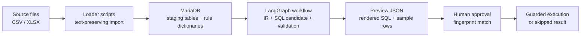

## 2. 공개 기준 프로젝트 구조

```text
.
├── app/
│   ├── streamlit_langgraph_test.py
│   └── langgraph_workflow/
│       ├── controller.py
│       ├── state.py
│       ├── db.py
│       ├── import_rules.py
│       ├── stage_01_parse.py
│       ├── stage_02_rule_lookup.py
│       ├── stage_03_sql.py
│       └── stage_04_output.py
├── scripts/
│   ├── load_da_sa_tables.py
│   ├── import_raw_data.py
│   ├── query_db.py
│   ├── apply_sql_file.py
│   ├── run_llama_cpp_server.sh
│   ├── run_streamlit.sh
│   └── run_langgraph_test_cases.py
├── migrations/
├── docs/public/
├── .env.example
├── compose.example.yaml
├── requirements.txt
├── requirements-langgraph.txt
└── requirements-mariadb.txt
```

`docs/public/`는 GitHub 공개 가능 문서 영역이다. 내부 설계 문서, migration 상세 운영값, raw data, DB backup, local model file, runtime log, `.env`, 로컬 compose 파일은 공개 artifact가 아니다.

## 3. 구성요소 관계도

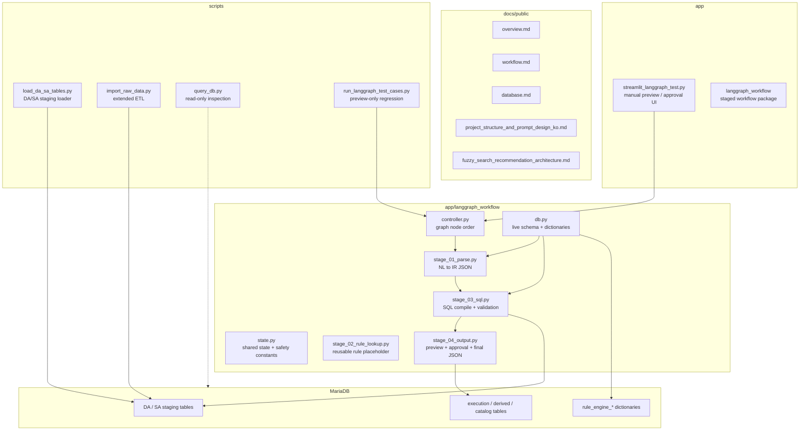

## 4. Runtime 구성요소

| 영역 | 역할 | 대표 파일 |
| --- | --- | --- |
| Loader | source file을 staging table로 적재하고 raw value를 text로 보존 | `scripts/load_da_sa_tables.py`, `scripts/import_raw_data.py` |
| Database | live schema, staging rows, dictionary metadata, execution metadata 저장 | `migrations/`, MariaDB |
| Workflow | 자연어 요청을 IR, SQL 후보, preview, 실행 결과로 변환 | `app/langgraph_workflow/` |
| UI | 사람이 preview를 보고 승인/거절하는 local validation surface | `app/streamlit_langgraph_test.py` |
| Test Runner | markdown case를 preview-only로 실행해 회귀 확인 | `scripts/run_langgraph_test_cases.py` |
| Public Docs | 공개 가능한 architecture, setup, safety 설명 | `docs/public/` |

MongoDB 스타일의 저장 규칙 조회 단계는 graph에 존재하지만, 공개 기준 local 구성에서 MongoDB가 provisioned되었다고 가정하지 않는다. 현재 문서에서는 reusable rule lookup placeholder 또는 별도 구성 가능한 확장 지점으로 설명한다.

## 5. LangGraph 전체 노드 구조도

현재 active graph는 `controller.py`의 `build_modification_workflow_graph(...)`가 정의한다. 각 node는 전체 state를 직접 덮어쓰기보다 다음 단계에 필요한 partial state dictionary를 반환한다.

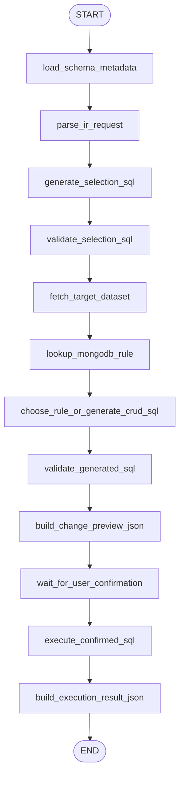

## 6. Stage별 State 입출력

| Stage | Node | 주요 입력 state | 주요 출력 state | 설명 |
| --- | --- | --- | --- | --- |
| Metadata | `load_schema_metadata` | DB connection/config | `table_columns`, `source_channel_values`, `schema_summary`, dictionary metadata | SQL 생성 전 live schema와 업무 사전을 먼저 읽는다. |
| Parse | `parse_ir_request` | `selection_text`, `modification_text`, `schema_summary` | `ir_structured_json`, `selection_request`, `modification_logic` | 자연어를 intent, 조회 범위, 조건, action 중심 IR로 구조화한다. |
| Selection SQL | `generate_selection_sql` | `selection_request` | `selection_sql_plan` | 대상 row를 찾기 위한 SELECT 후보를 deterministic하게 만든다. |
| Selection Validation | `validate_selection_sql` | `selection_sql_plan`, live schema | `selection_validation_result` | table, source value, parameter count, unresolved term을 검증한다. |
| Fetch | `fetch_target_dataset` | validated selection plan | `target_rows` | preview와 SQL compile 보조를 위한 대상 row를 읽는다. |
| Rule Lookup | `lookup_mongodb_rule` | `modification_logic`, `stored_rules` | `matched_rules`, `effective_modification_plan` | 저장 규칙이 있으면 재사용 후보를 만든다. |
| Candidate SQL | `choose_rule_or_generate_crud_sql` | IR, target rows, schema, dictionaries | `precompiled_where`, `sql_candidate` | intent별 renderer 또는 LLM action plan을 SQL 후보로 compile한다. |
| SQL Validation | `validate_generated_sql` | `sql_candidate`, live schema, policies | `parsed_sql`, `validation_result` | SQL shape, table/column, dangerous token, parameter count, predicate, protected column을 검증한다. |
| Preview | `build_change_preview_json` | `sql_candidate`, `validation_result` | `preview_rows`, `change_preview_json` | 실행 전 SQL preview, sample rows, fingerprint를 만든다. |
| Approval | `wait_for_user_confirmation` | `change_preview_json`, approval fields | `user_confirmation` | 승인/거절과 fingerprint match 여부를 반영한다. |
| Execution | `execute_confirmed_sql` | validation, preview, confirmation, SQL | `execution_result` | 모든 gate가 통과한 경우에만 실행한다. |
| Output | `build_execution_result_json` | 전체 state | `output_json` | IR, SQL, sample rows, execution status를 최종 JSON으로 묶는다. |

## 7. State Contract 요약

`ModificationWorkflowState`는 node 간 공유 계약이다. State는 다음과 같은 층으로 볼 수 있다.

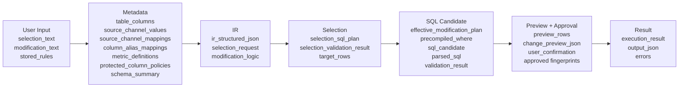

State에 들어온 LLM 결과는 실행 가능한 명령이 아니다. 후속 deterministic compiler와 validator가 live schema 기준으로 다시 검증해야 한다.

## 8. DB Metadata와 Dictionary 흐름

`db.py`는 매 workflow 실행 전에 live DB metadata를 읽어 prompt와 validator에 제공한다.

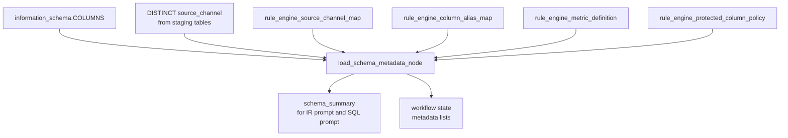

이 metadata는 LLM prompt에 일부 요약되어 들어가지만, 최종 안전 판단은 prompt가 아니라 validator가 수행한다.

## 9. 프롬프트 설계 원칙

현재 active LLM prompt는 두 개뿐이다. 나머지 SQL 생성과 검증은 deterministic Python code가 담당한다.

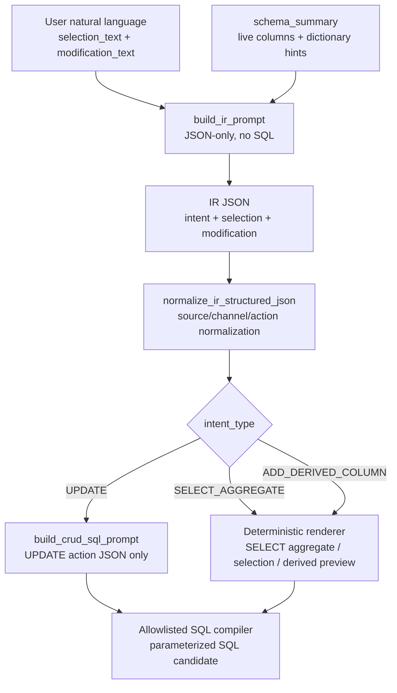

### 9.1 IR 구조화 프롬프트

`stage_01_parse.py`의 `build_ir_prompt(...)`는 자연어 조회 조건과 수정 조건을 하나의 IR JSON으로 구조화한다. 이 단계는 SQL을 만들지 않는다.

주요 입력은 다음과 같다.

- `selection_text`: 사용자가 말한 조회 범위
- `modification_text`: 사용자가 말한 수정/계산/파생 요청
- `schema_summary`: live schema, source candidate, 업무 사전 metadata 요약

출력 contract는 JSON object다.

```json
{
  "intent_type": "UPDATE_NUMERIC_VALUE | ADD_DERIVED_COLUMN | SELECT_AGGREGATE | ASK_CLARIFICATION",
  "selection": {
    "customer": "default",
    "period": {},
    "source_channels": [],
    "tables": ["DA 또는 SA"],
    "unresolved_terms": []
  },
  "modification": {
    "condition_groups": [],
    "group_by": [],
    "metrics": [],
    "derived_column": {}
  }
}
```

Prompt는 `/no_think`, JSON-only, no-markdown, no-SQL 지시를 사용한다. LLM이 schema에 없는 table, column, source value를 임의로 만들지 않도록 하고, 확신이 없는 업무 용어는 `unresolved_terms`로 남기도록 설계되어 있다.

### 9.2 CRUD action-plan 프롬프트

`stage_03_sql.py`의 `build_crud_sql_prompt(...)`는 UPDATE 계열 변경에서 LLM에게 SQL 문자열이 아니라 action 후보 JSON만 요청한다.

```json
{
  "action": {
    "target_field": "schema에 존재하는 수정 가능 컬럼",
    "operation": "set_literal",
    "value": "설정할 값"
  },
  "reason": "선택 이유"
}
```

실제 SQL은 `generate_crud_sql_candidate(...)`에서 action을 검증하고 `UPDATE <table> SET ... WHERE ...` 형태로 compile한다. LLM이 raw SQL을 제출하더라도 workflow는 이를 실행 경로로 사용하지 않는 설계다.

### 9.3 현재 active path가 아닌 prompt scaffold

`stage_01_parse.py`에는 `build_selection_prompt(...)`와 `build_modification_prompt(...)`도 존재한다. 하지만 현재 graph의 active path에는 연결되어 있지 않다. 현재 active LLM 호출은 IR prompt와 CRUD action-plan prompt로 제한된다.

## 10. Intent별 SQL 후보 생성 정책

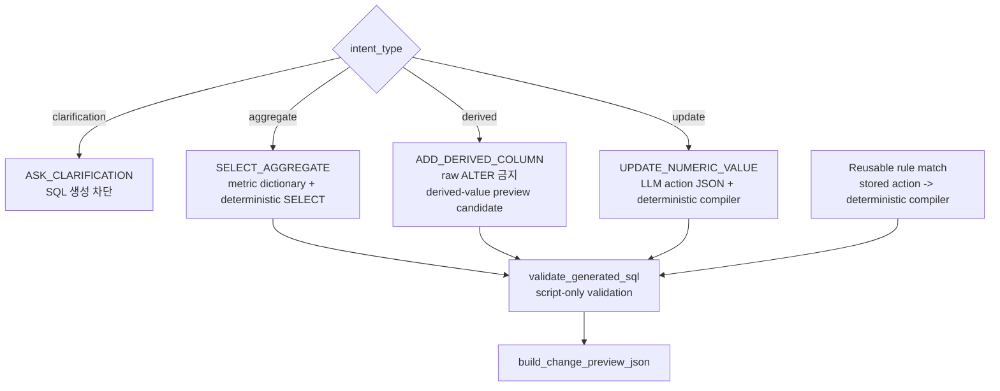

| Intent/분기 | SQL 후보 생성 방식 | LLM 사용 여부 | 실행 가능성 |
| --- | --- | --- | --- |
| 저장 규칙 match | 저장 rule action을 deterministic compiler로 변환 | 사용 안 함 | validation과 approval 통과 시 가능 |
| `SELECT_AGGREGATE` | metric/dimension dictionary와 IR로 aggregate SELECT 생성 | 사용 안 함 | SELECT 결과 조회용 |
| `ADD_DERIVED_COLUMN` | raw table ALTER가 아니라 derived-value INSERT 후보 생성 | 사용 안 함 | preview-only, `execution_allowed=False` |
| UPDATE 계열 | LLM action-plan JSON + deterministic SQL compiler | action 선택에만 사용 | validation과 approval 통과 시 가능 |
| `ASK_CLARIFICATION` | SQL 생성 차단 | 사용 안 함 | 실행 안 함 |

`ADD_DERIVED_COLUMN`은 raw staging table에 새 컬럼을 추가하지 않는다. 대신 source row identity와 derived key/value를 `rule_engine_derived_value`에 기록하는 후보 SQL을 만들고, 현재 workflow에서는 preview-only로 둔다.

## 11. SQL Validation Gate

`validate_generated_sql`은 LLM validation이 아니라 script-only validation이다. SQL text, metadata, live schema, protected policy가 서로 일치해야 preview로 넘어갈 수 있다.

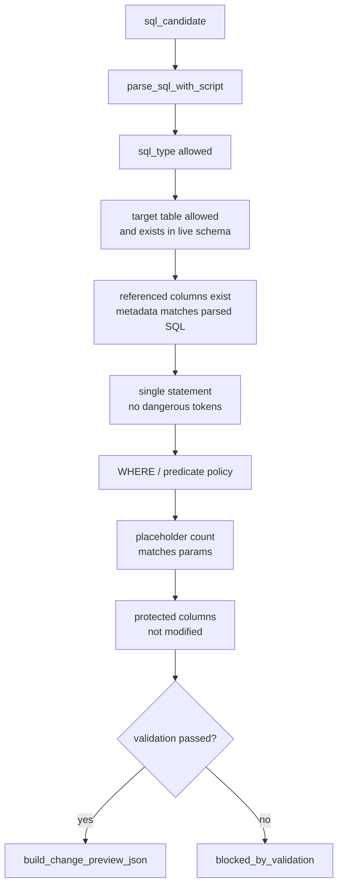

주요 guardrail은 다음과 같다.

| Guardrail | 설명 |
| --- | --- |
| Live schema metadata | `information_schema` 기준으로 현재 존재하는 table과 column만 허용한다. |
| Allowed table set | workflow 대상은 `DA`, `SA`로 제한한다. |
| DB-backed dictionaries | source/channel mapping, column alias, metric definition, protected-column policy를 DB row로 관리한다. |
| Protected write policy | provenance, date, id-like, hash-like, source identity 계열 column은 수정 대상에서 제외한다. |
| Dangerous token rejection | semicolon과 SQL comment token 등 multi-statement/comment path를 거부한다. |
| Parameter count check | SQL template의 placeholder 수와 params 수가 일치해야 한다. |
| WHERE policy | write 계열 SQL은 broad predicate 또는 WHERE 누락 상태로 실행될 수 없다. |
| Predicate metadata check | preview와 SQL WHERE가 동일한 predicate column metadata를 가져야 한다. |
| Fingerprint gate | SQL fingerprint와 preview fingerprint가 승인 시점에 동일해야 한다. |

## 12. Preview와 승인 정책

`stage_04_output.py`는 SQL 후보를 즉시 실행하지 않고 preview JSON을 만든다. Preview에는 rendered SQL, SQL fingerprint, preview fingerprint, affected row count, sample row 변화 예시, validation result가 포함된다.

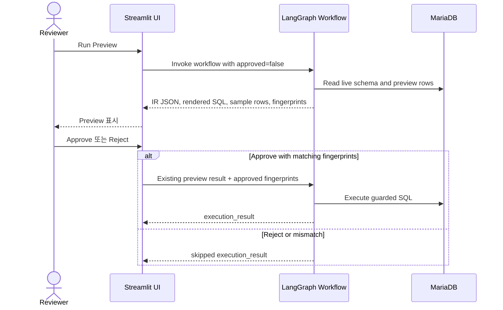

실행 조건은 다음 네 가지가 모두 true여야 한다.

1. `validation_result.status == "passed"`
2. `change_preview_json.status == "pending_user_confirmation"`
3. 사용자가 명시적으로 approve함
4. 승인된 SQL fingerprint와 preview fingerprint가 현재 preview의 fingerprint와 일치함

조건이 하나라도 실패하면 실행 결과는 skipped 상태가 된다. preview-only SQL 후보도 실행하지 않는다.

샘플 row 출력은 검토 편의와 공개 안전성을 위해 hash column과 전체 값이 비어 있는 column을 숨긴다. Streamlit UI는 JSON dump 대신 table/dataframe 형태로 sample rows를 보여준다.

## 13. Output JSON 구조

최종 output은 사람이 검토할 수 있는 네 영역으로 정리된다.

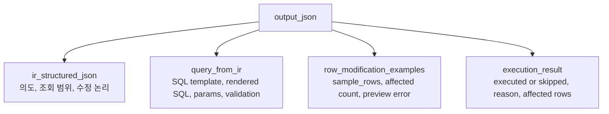

Preview는 execution output이 아니다. validation failure, user rejection, fingerprint mismatch, no connection, preview-only candidate는 모두 skipped result로 남는다.

## 14. Local LLM Client 설계

UI와 test runner는 OpenAI-compatible local LLM endpoint를 사용한다. 공개 문서에서는 model file path, process id, local IP, GPU/driver 상태 같은 환경 고유 정보는 기록하지 않는다.

| 항목 | 기본 정책 |
| --- | --- |
| Endpoint | OpenAI-compatible `/v1` endpoint |
| Model alias | local model alias |
| Temperature | deterministic에 가까운 낮은 값 |
| Max tokens | prompt/response 크기를 제한하는 값 |
| Timeout | long-running local inference를 감안한 값 |
| Thinking mode | env가 명시적으로 켜지지 않으면 disabled |

LLM 요청은 IR 구조화와 UPDATE action-plan 생성에만 사용한다. SQL 검증, preview 생성, approval gate는 LLM 판단에 의존하지 않는다.

## 15. Test와 검수 경로

검수는 단계별로 좁게 시작해서 넓히는 방식이 적합하다.

| 검수 대상 | 권장 경로 |
| --- | --- |
| DB 연결과 row count | `scripts/query_db.py`의 read-only command |
| 수동 preview/approval | `streamlit run app/streamlit_langgraph_test.py` 또는 wrapper script |
| 여러 자연어 case preview | `scripts/run_langgraph_test_cases.py` |
| 문서 공개 안전성 | `docs/public/` 내부 문서만 commit 대상인지 확인 |

`scripts/run_langgraph_test_cases.py`는 preview-only regression harness다. DB write를 수행하는 approval flow와 구분해야 한다.

## 16. 유사 검색 추천 확장과의 관계

유사 검색 추천 구조는 별도 문서 [fuzzy_search_recommendation_architecture.md](./fuzzy_search_recommendation_architecture.md)에 정리되어 있다. 이 확장은 원본 query를 자동 치환하지 않고, preview 화면에서 “원하는 결과가 아닌가요?” 형태의 추천 조건을 제시하는 UX layer로 설계한다.

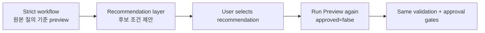

추천 조건은 실행 권한을 갖지 않는다. 사용자가 선택한 뒤에도 반드시 다시 preview를 실행하고, 기존 validation/approval/fingerprint gate를 통과해야 한다.

## 17. 공개 문서 작성 규칙

공개 문서에는 다음을 포함하지 않는다.

- 실제 고객명, 계정명, production database name
- 원천 파일명, source-channel 실값, raw row sample
- credentials, token, private endpoint, backup path
- local absolute path, local IP, PID, runtime log 내용
- 내부 prompt 전문, agent note, private business rule
- 운영 schema의 민감한 컬럼 예시나 스크린샷

반대로 공개 문서에는 architecture pattern, source file role, stage responsibility, generic placeholder example, safety policy, validation policy처럼 제품화 가능한 일반 설명만 남긴다.

## 18. 요약

이 workflow의 핵심은 LLM을 SQL 실행 주체로 두지 않는 것이다. LLM은 자연어를 IR로 구조화하거나 UPDATE action 후보를 JSON으로 제안한다. SQL 후보 생성, schema 검증, parameter 검증, preview 생성, 승인 fingerprint 확인, 실행 여부 결정은 deterministic Python code와 DB metadata가 담당한다.

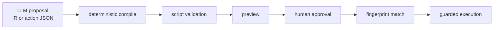
